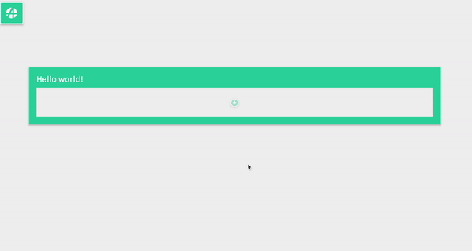

# Layout / Nested widgets

You’ve built a couple of custom widgets, you’ve got a powerful `area` running down the main column of your template. Awesome! Now you want start pairing widgets up, creating complex layouts of widgets. `singletons` let you enforce particular widgets in particular pieces of layout, but you want the editor to decide where it's appropriate to create these complex arrangements and be able to mix them with simpler widgets.

You want a widget that creates a layout of inner widgets.

## Create a layout widget

Generally, you need a dedicated widget to create layout. The Apostrophe team sometimes refers to these as ‘layout widgets’ that give form and structure to ‘content widgets’ \(widgets whose sole job is to display content\). **In this example we'll make a simple two column layout.**

1. Use the [`apostrophe-cli`](https://github.com/punkave/apostrophe-cli) to quickly build a widget.

    ```bash
    apostrophe create-widget two-column
    ```

2. Include the layout widget in our `app.js` by adding the following to the `modules` object:

    ```javascript
      // app.js
      modules: {
        // ...,
        'two-column-widgets': {}
      }
    ```

3. Define what can be in a `two-column` widget by defining it in `lib/modules/two-column-widgets/index.js`:


    ```javascript
    // lib/modules/two-column-widgets/index.js
    module.exports = {
      extend: 'apostrophe-widgets',
      label: 'Two Column Layout',
      contextualOnly: true,
      addFields: [
        {
          name: 'areaLeft',
          type: 'area',
          label: 'Left Area',
        },
        {
          name: 'areaRight',
          type: 'area',
          label: 'Right Area',
        }
      ]
    };
    ```

### Conveniences for layout widgets \(contextualOnly and skipInitialModal\)

**contextualOnly: true** If your widget contains _only_ other areas and singletons that you want to edit contextually on the page then you don't need the typical manager modal UI popping up when you create the widget. Nor do you need an Edit button UI to edit non-existing configuration. `contextualOnly` will shortcut these and instantly plop your empty widget on the page.



**skipInitialModal: true** An alternative to `contextualOnly`, `skipInitialModal` lets you skip the widget manager modal when the widget is created \(like `contextualOnly`\) but preserves the Edit UI for later use. This is useful for widgets that have secondary configuration, like setting a background color.

## Putting it in the page

Now, like any other widget, you need to have a `widget.html` template. In this case we'll use that template to call `apos.area` once for each area and introduce nested widgets.

In `lib/modules/two-column-widgets/views/widget.html`

   ```django
    {# lib/modules/two-column-widgets/views/widget.html #}
    <div class="two-column">
        <div class="column-left">
            {{ apos.area(data.widget, 'areaLeft', {
                widgets: {
                    'apostrophe-images': {}
                }
            }) }}
        </div>
        <div class="column-right">
            {{ apos.area(data.widget, 'areaRight', {
                widgets: {
                    'apostrophe-images': {}
                }
            }) }}
        </div>
    </div>
    ```

::: tip NOTE
"Why are the two columns stacked on top of each other?" You need to write your own CSS to position the `column-left` and `column-right` divs. However, you can find a [complete, working example with CSS here in the apostrophe-samples project](https://github.com/apostrophecms/apostrophe-samples).
:::


